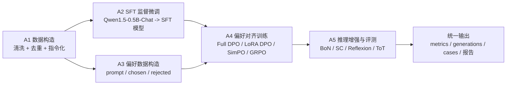
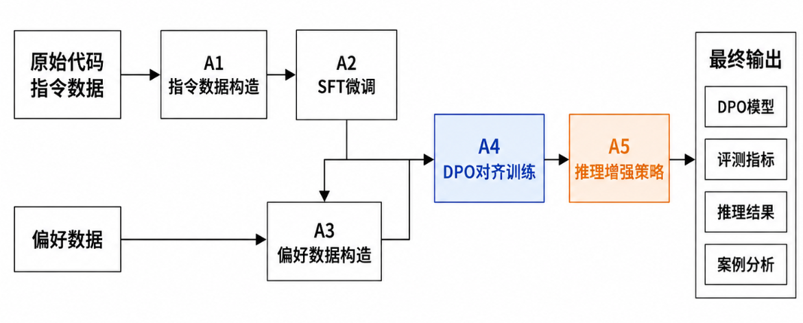

# Group4-Task-A README

---

## 1. 项目概览

### 1.1 项目名称

`面向 Python 代码生成的大模型微调、偏好对齐与推理增强系统`

### 1.2 项目目标

本项目选择的是“代码生成能力优化”方向，面向 Python 编程题自动求解场景，目标是提升小参数大模型在代码生成任务上的可执行正确率与稳定性。

我们围绕 `Qwen1.5-0.5B-Chat` 构建了一条完整实验链路：

- 从原始任务数据中构造高质量指令数据；
- 通过 SFT 提升模型基础代码生成能力；
- 通过偏好对齐训练进一步优化模型输出倾向；
- 在推理阶段加入多候选筛选、反思修复和树搜索等增强策略；
- 使用统一自动评测流程，在 MBPP 基准上量化比较各方法效果。

项目最终实现的核心能力是：

- 能根据自然语言编程题描述生成 Python 代码；
- 能通过偏好对齐让模型更倾向于输出高质量代码；
- 能通过推理增强策略提升最终通过测试的概率；
- 能对所有实验结果进行统一评测与对比分析。

### 1.3 当前完成情况

| 类型 | 完成情况 |
|---|---|
| 基础要求 | 已完成 A1 数据构造、A2 SFT、A3 偏好数据构造、A4 偏好对齐训练、A5 推理增强与统一评测 |
| 进阶要求 | 已完成 Full DPO、LoRA DPO、SimPO、GRPO，以及 Best-of-N、Self-Consistency、Reflexion、Tree of Thoughts 等扩展实验 |
| 支持的主要任务类型 | Python 代码生成、偏好对齐训练、测试时推理增强、MBPP 自动评测 |
| 当前限制 | 依赖本地模型与实验环境；部分方法运行成本较高；不同训练策略在小模型上稳定性仍有限 |

---

## 2. 整体流程与模块结构

### 2.1 模块边界

| 模块 / 阶段 | 入口文件 / 入口函数 | 主要职责 | 输入 | 输出 |
|---|---|---|---|---|
| A1 指令数据构造 | 团队数据预处理脚本 | 清洗原始数据、划分训练集、转为指令格式 | 原始任务数据 | SFT 指令数据 |
| A2 SFT 监督微调 | 团队 SFT 训练脚本 | 训练基础代码生成模型 | 指令数据、基础模型 | SFT 模型目录 |
| A3 偏好数据构造 | 团队偏好数据脚本 | 构造 `chosen/rejected` 数据 | 原始样本、候选答案 | 偏好训练数据 |
| A4 偏好对齐训练 | `train_grpo_code.py`、DPO 相关脚本 | Full DPO、LoRA DPO、SimPO、GRPO 训练与评测 | SFT 模型、偏好数据 | 对齐后模型、训练日志、评测结果 |
| A5 推理增强与统一评测 | `mbpp_eval_*.py` | Best-of-N、Self-Consistency、Reflexion、ToT 与统一自动评测 | 已训练模型、MBPP 测试集 | `metrics.json`、`generations.jsonl`、`cases.jsonl` |

### 2.2 系统架构图或流程图



- 系统总体架构图
- 训练过程截图
- 多方法结果对比截图

### 2.3 一次完整任务或实验的流程

一次完整实验的流转过程如下：

1. 从原始任务数据中提取题目描述、参考代码和测试样例；
2. A1 将其清洗并转换为 SFT 指令格式；
3. A2 使用这些指令数据对基础模型进行监督微调；
4. A3 构造偏好数据，为同一题目提供 `chosen` 与 `rejected` 两类候选代码；
5. A4 接收 SFT 模型与偏好数据，进行 DPO、LoRA DPO、SimPO 或 GRPO 训练；
6. A5 选择某个模型在 MBPP 测试集上运行推理增强策略；
7. 对每条生成结果做代码提取、语法检查和单元测试执行；
8. 将结果汇总为结构化指标文件与逐题 case 文件；
9. 输出最终实验结论、对比表格和展示材料。

---

## 3. 模型、数据集与外部资源

### 3.1 模型说明

| 项目 | 内容 |
|---|---|
| 使用模型 | `Qwen1.5-0.5B-Chat` 及其 SFT / DPO / GRPO 变体 |
| 模型来源 | 课程实验环境提供或本地下载 |
| 项目内相对路径 | 训练后模型通常位于 `dpo/outputs/...` |
| 是否需要 GPU | 需要 |

在当前项目材料中，常见模型路径包括：

```text
/home/wangmengxin/assignment_A/sft/outputs/qwen15_code_full_sft
dpo/outputs/qwen15_code_full_dpo
dpo/outputs/qwen15_code_lora_grpo_v5
```

### 3.2 数据集 / 示例数据说明

| 数据或文件 | 用途 | 来源 | 项目内相对路径 |
|---|---|---|---|
| MBPP sanitized 数据集 | 代码生成评测 | 课程实验数据 | `mbpp/` 相关 parquet 数据 |
| 指令数据 | SFT 训练 | A1 构造 | 团队数据目录 |
| 偏好数据 | DPO / GRPO 训练 | A3 构造 | `dpo/data/code_dpo_train.json`、`code_grpo_train.json` |
| 评测结果文件 | 对比分析 | 本项目输出 | 各 `mbpp_*` 目录 |

---

## 4. 环境安装

### 4.1 运行环境

| 项目 | 要求 |
|---|---|
| Python 版本 | Python 3.10 |
| 操作系统 / 服务器环境 | Linux 训练环境优先，本地 Windows 可用于整理结果与文档 |
| GPU 要求 | 建议使用支持 CUDA 的 GPU；无 GPU 时仅适合调试或阅读结果 |
| 主要依赖 | `torch`、`transformers`、`datasets`、`peft`、`trl`、`pandas`、`pyarrow` |

### 4.2 安装步骤

```bash
# 创建环境
conda create -n shixun-sft python=3.10 -y
conda activate shixun-sft

# 安装依赖
pip install -e ./LlamaFactory --index-url https://pypi.tuna.tsinghua.edu.cn/simple
pip install jieba nltk rouge_chinese
```

常见环境问题：

- 模型路径不存在：需要检查本地模型目录或训练输出目录是否一致。
- 依赖版本不兼容：建议与课程实验环境保持一致。
- GPU 显存不足：可通过降低 `batch_size`、减少 `num_candidates` 或改用 LoRA 训练缓解。

---

## 5. 输入文件与配置文件说明

### 5.1 主要配置文件

| 配置文件 | 作用 | 需要修改的字段 |
|---|---|---|
| DPO / GRPO 训练配置 | 控制训练方式与超参数 | 模型路径、数据路径、学习率、epoch、输出目录 |
| 各 `mbpp_eval_*.py` 脚本参数 | 控制推理增强与评测 | `model_path`、`output_dir`、`num_candidates`、`temperature` |

### 5.2 主要输入文件

| 输入文件 | 用途 | 适用场景 |
|---|---|---|
| MBPP parquet 数据 | 评测代码生成能力 | 评测 |
| `code_dpo_train.json` | 偏好对齐训练 | 训练 |
| `code_grpo_train.json` | GRPO 训练 | 训练 |
| 本地模型目录 | 推理或继续训练 | 训练 / 推理 |

---

## 6. 完整流程 Demo 运行

### 6.1 Demo 样例说明

| Demo | 输入文件 / 输入内容 | 演示目的 |
|---|---|---|
| Demo 1：单模型 MBPP 评测 | 本地模型目录 + MBPP 测试集 | 验证基础评测流程 |
| Demo 2：Best-of-N 推理增强 | GRPO 模型 + MBPP 测试集 | 验证多候选筛选对结果的提升 |
| Demo 3：Reflexion / ToT | GRPO 模型 + MBPP 测试集 | 验证复杂推理增强策略的收益与成本 |

### 6.2 运行命令

```bash
# Demo 1：基础评测
python mbpp_eval_dpo.py \
  --model_path /path/to/model \
  --output_dir ./mbpp_eval_result
```

```bash
# Demo 2：Best-of-N
python mbpp_eval_dpo_bestofn.py \
  --model_path /path/to/model \
  --output_dir ./mbpp_bestofn_result \
  --num_candidates 32 \
  --temperature 0.8
```

```bash
# Demo 3：Reflexion
python mbpp_eval_reflexion.py \
  --model_path /path/to/model \
  --output_dir ./mbpp_reflexion_result \
  --num_candidates 32 \
  --repair_attempts 1
```

```bash
# Demo 4：Tree of Thoughts
python mbpp_eval_tot.py \
  --model_path /path/to/model \
  --output_dir ./mbpp_tot_result \
  --num_thoughts 6 \
  --branches_per_thought 2 \
  --beam_width 4 \
  --expand_rounds 1
```

### 6.3 关键参数说明

| 参数 | 说明 |
|---|---|
| `--model_path` | 指定待评测模型目录 |
| `--output_dir` | 结果输出目录 |
| `--num_candidates` | 候选代码数量，影响 Best-of-N / Self-Consistency 成本与效果 |
| `--temperature` | 采样温度，影响候选多样性 |
| `--repair_attempts` | Reflexion 修复次数 |
| `--num_thoughts` | ToT 初始 thought 数 |
| `--beam_width` | ToT 每轮保留路径宽度 |

### 6.4 运行成功的判断方式

- 终端输出中出现最终 `metrics` 信息且无关键报错。
- 输出目录中生成：
  - `mbpp_metrics.json`
  - `mbpp_generations.jsonl`
  - `mbpp_cases.jsonl`
- `mbpp_metrics.json` 中包含 `pass_at_1`、`syntax_pass_rate`、`avg_test_pass_rate` 等字段。

---

## 7. 输出文件与结果说明

### 7.1 主要输出文件

| 输出文件 | 生成模块 / 阶段 | 格式 | 说明 |
|---|---|---|---|
| `mbpp_metrics.json` | A4/A5 评测 | JSON | 汇总指标 |
| `mbpp_generations.jsonl` | A5 推理增强 | JSONL | 原始生成结果 |
| `mbpp_cases.jsonl` | A5 推理增强 | JSONL | 逐题详细 case |
| 训练后模型目录 | A4 训练 | 模型权重 | 对齐后模型 |
| `comparison.json` | 指标对比脚本 | JSON | 两组实验结果差值 |

### 7.2 运行截图或结果图例

建议在最终仓库中补充：

- 训练过程截图
- 推理增强运行截图
- 结果对比表截图
- 最优结果文件截图

---

## 8. 协作实现说明

本项目的协作方式主要体现在以下几个方面：

- 先约定统一的数据流：A1 输出给 A2，A3 输出给 A4，A4 输出给 A5。
- 在训练前约定好偏好数据字段格式，保证 DPO / GRPO 脚本可以直接读取。
- 在推理评测阶段约定统一结果文件命名方式：`metrics`、`generations`、`cases`。
- 在联调过程中统一模型路径、数据目录与结果目录，避免因目录不一致导致脚本报错。
- 多模块协作完成的核心能力包括：从原始数据构造到训练、从训练到推理增强、从推理结果到统一指标汇总。

团队成员分工如下：

| 成员 | 学号 | 负责内容 |
|---|---:|---|
| 彭博 | 20235850 | A4 偏好对齐训练、A5 推理增强与统一评测 |
| 王梦欣 | 20235764 | A2 SFT 监督微调 |
| 于子宸 | 20235909 | A1 指令数据构造 |
| 王赫 | 20235817 | A3 偏好数据构造 |

---

## 9. 已知问题与改进方向

| 问题 | 当前原因 | 可能改进 |
|---|---|---|
| 部分偏好对齐方法收益不稳定 | 小模型容量有限，偏好数据与超参数敏感 | 提升偏好数据质量，优化训练轮数与学习率 |
| 推理增强运行成本较高 | 多候选生成 + 单元测试执行时间长 | 引入并行评测、早停与缓存机制 |
| ToT 语法率高但 pass@1 提升有限 | 搜索策略偏重结构完整性而非逻辑正确性 | 改进 thought 评分和错误反馈机制 |

